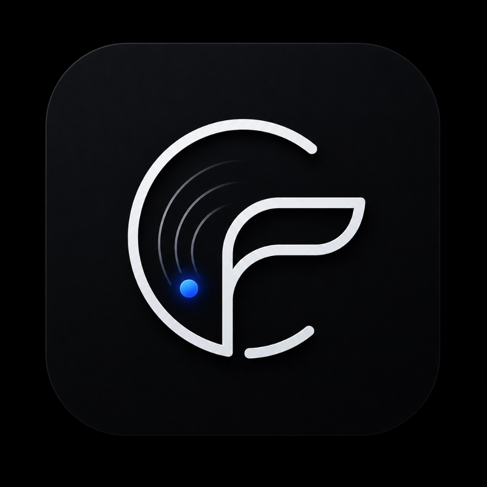

  
   
  <h1>Architecting the Future of Personal Intelligence</h1>
  

    
    
  

  
📍 Bhusawal, Maharashtra, IN

  

---

## 🌌 The Vision

I specialize in the intersection of **Human Biology** and **Artificial Intelligence**. My work focuses on creating **local-first, privacy-centric intelligent operating systems** that don't just process data—they augment human existence. I build for the disciplined, the focused, and those who demand absolute data sovereignty.

---

## 🚀 Flagship Ecosystem

### 🧠 LifeOS: Neural Augmentation for Daily Life
<table width="100%">
  <tr>
    <td width="50%">
      

        
         
        
      

    </td>
    <td width="50%" valign="top">
      <h4>Social Productivity Redefined</h4>
      
LifeOS is a social productivity platform where discipline meets community. It's designed to transform your daily routines into a gamified, high-performance journey.

      <ul>
        <li><b>AI-Driven Discipline</b>: Automated task difficulty and proof-based validation.</li>
        <li><b>Social Synchronization</b>: Public and private spaces for collaborative growth.</li>
        <li><b>Biological Alignment</b>: Merging productivity with your natural energy cycles.</li>
      </ul>
      

        
        
      

       
      
<a href="https://joinlifeos.vercel.app" target="_blank"><b>Explore LifeOS →</b></a>

    </td>
  </tr>
</table>

### 🤖 Jarvis AI: Your Digital Twin
<table width="100%">
  <tr>
    <td width="50%" valign="top">
      <h4>Personal Intelligence Operating System</h4>
      
Not a chatbot, but a proactive partner. Jarvis AI is a local-first intelligence layer for Android that learns your habits and automates your life.

      <ul>
        <li><b>Episodic Memory</b>: 16-module core memory architecture for total context recall.</li>
        <li><b>Autonomous Orchestration</b>: Multi-agent system (Planner, Memory, Action) for complex tasks.</li>
        <li><b>Privacy-First</b>: All learning and data stay on-device. No tracking.</li>
      </ul>
      
<a href="https://github.com/patil-shubham-dev/Jarvis-Ai"><b>Explore Jarvis AI →</b></a>

    </td>
    <td width="50%">
      

        
         
        
      

    </td>
  </tr>
</table>

### ⚡ FlowOS: The Performance Engine
<table width="100%">
  <tr>
    <td width="50%">
      

        
         
        
      

    </td>
    <td width="50%" valign="top">
      <h4>Autonomous Intelligence OS</h4>
      
FlowOS is a performance-obsessed operating system designed to synchronize your execution with your biology. It's the ultimate tool for high-performance individuals.

      <ul>
        <li><b>Neural Engine</b>: On-device vector embeddings for semantic fact retrieval.</li>
        <li><b>Bio-Sync Architecture</b>: Circadian-aligned task scheduling and energy optimization.</li>
        <li><b>OLED-First Design</b>: Premium, high-contrast UI for maximum focus and efficiency.</li>
      </ul>
      
<a href="https://github.com/patil-shubham-dev/FlowOS"><b>Explore FlowOS →</b></a>

    </td>
  </tr>
</table>

---

## 🛠️ Technical Arsenal

  <table>
    <tr>
      <td align="center"><b>Intelligence</b></td>
      <td align="center"><b>Mobile & Systems</b></td>
      <td align="center"><b>Architecture</b></td>
    </tr>
    <tr>
      <td>ONNX Runtime, Vector Embeddings, Multi-Agent Orchestration, Whisper, LLM Gateway</td>
      <td>Kotlin, Jetpack Compose, Android OS Integration, React Native, Java</td>
      <td>Drizzle, MySQL/TiDB, Room, Encrypted Storage, Git, GitHub Actions</td>
    </tr>
  </table>

---

## 🧠 Core Philosophy

> "I don't build features; I build ecosystems. My goal is to bridge the gap between human intent and machine execution, ensuring that technology serves as a seamless extension of our biology, not a distraction from it."

---

## 📈 Future Trajectory

*   **LifeOS Core Loop**: Finalizing the social productivity MVP.
*   **Jarvis Voice Engine**: Next-gen natural language control layer.
*   **Neural Proofing**: AI-driven validation for complex human achievements.

---

  
<b>Let's build the future of intelligence.</b>

  
  
    

